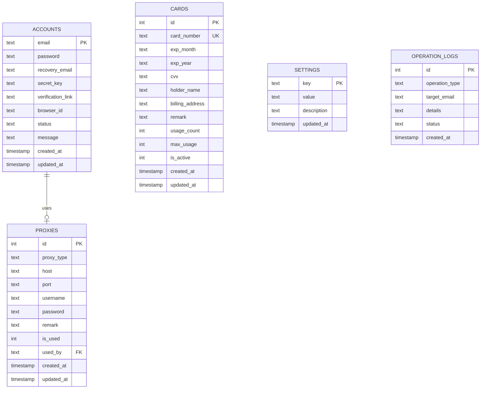

# 数据库设计文档

## 概述

本项目使用 **SQLite** 作为本地数据库，存储账号、代理、卡片等数据。数据库文件位置：`data/accounts.db`

## 数据库表结构

### 1. accounts（账号表）

存储所有账号信息及其状态。

```sql
CREATE TABLE accounts (
    email TEXT PRIMARY KEY,           -- 邮箱（主键）
    password TEXT,                     -- 密码
    recovery_email TEXT,               -- 辅助邮箱
    secret_key TEXT,                   -- 2FA密钥（TOTP）
    verification_link TEXT,            -- SheerID验证链接
    browser_id TEXT,                   -- 比特浏览器窗口ID
    status TEXT DEFAULT 'pending_check', -- 账号状态
    message TEXT,                      -- 状态消息/备注
    created_at TIMESTAMP DEFAULT CURRENT_TIMESTAMP,  -- 创建时间
    updated_at TIMESTAMP DEFAULT CURRENT_TIMESTAMP   -- 更新时间
)
```

#### 状态值说明

| 状态值 | 说明 | 描述 |
|--------|------|------|
| `pending_check` | 待检查 | 新导入的账号，尚未验证 |
| `link_ready` | 链接就绪 | 已提取SheerID验证链接，待验证 |
| `verified` | 已验证 | 通过学生验证，未绑卡 |
| `subscribed` | 已订阅 | 已绑卡并成功订阅 |
| `ineligible` | 无资格 | 不符合学生资格 |
| `error` | 错误 | 处理过程中发生错误 |
| `running` | 运行中 | 正在处理 |
| `processing` | 处理中 | 正在处理 |

---

### 2. proxies（代理表）

存储代理服务器配置。

```sql
CREATE TABLE proxies (
    id INTEGER PRIMARY KEY AUTOINCREMENT,  -- 自增ID
    proxy_type TEXT DEFAULT 'socks5',       -- 代理类型
    host TEXT NOT NULL,                     -- 主机地址
    port TEXT NOT NULL,                     -- 端口
    username TEXT,                          -- 用户名（可选）
    password TEXT,                          -- 密码（可选）
    remark TEXT,                            -- 备注
    is_used INTEGER DEFAULT 0,              -- 是否已使用
    used_by TEXT,                           -- 使用者邮箱
    created_at TIMESTAMP DEFAULT CURRENT_TIMESTAMP,
    updated_at TIMESTAMP DEFAULT CURRENT_TIMESTAMP
)
```

#### 代理类型

| 类型 | 说明 |
|------|------|
| `socks5` | SOCKS5代理 |
| `http` | HTTP代理 |
| `https` | HTTPS代理 |

---

### 3. cards（卡片表）

存储虚拟卡/信用卡信息。

```sql
CREATE TABLE cards (
    id INTEGER PRIMARY KEY AUTOINCREMENT,  -- 自增ID
    card_number TEXT NOT NULL UNIQUE,       -- 卡号（唯一）
    exp_month TEXT NOT NULL,                -- 过期月份
    exp_year TEXT NOT NULL,                 -- 过期年份
    cvv TEXT NOT NULL,                      -- CVV安全码
    holder_name TEXT,                       -- 持卡人姓名
    billing_address TEXT,                   -- 账单地址
    remark TEXT,                            -- 备注
    usage_count INTEGER DEFAULT 0,          -- 已使用次数
    max_usage INTEGER DEFAULT 1,            -- 最大使用次数
    is_active INTEGER DEFAULT 1,            -- 是否激活
    created_at TIMESTAMP DEFAULT CURRENT_TIMESTAMP,
    updated_at TIMESTAMP DEFAULT CURRENT_TIMESTAMP
)
```

---

### 4. settings（设置表）

存储系统配置。

```sql
CREATE TABLE settings (
    key TEXT PRIMARY KEY,      -- 设置键
    value TEXT,                 -- 设置值
    description TEXT,           -- 描述
    updated_at TIMESTAMP DEFAULT CURRENT_TIMESTAMP
)
```

#### 常用设置项

| 键名 | 说明 | 默认值 |
|------|------|--------|
| `sheerid_api_key` | SheerID API密钥 | - |
| `batch_size` | 批处理大小 | 5 |
| `delay_min` | 最小延迟(秒) | 2 |
| `delay_max` | 最大延迟(秒) | 5 |

---

### 5. operation_logs（操作日志表）

记录所有操作历史。

```sql
CREATE TABLE operation_logs (
    id INTEGER PRIMARY KEY AUTOINCREMENT,  -- 自增ID
    operation_type TEXT NOT NULL,           -- 操作类型
    target_email TEXT,                      -- 目标邮箱
    details TEXT,                           -- 详情
    status TEXT,                            -- 状态
    created_at TIMESTAMP DEFAULT CURRENT_TIMESTAMP
)
```

#### 操作类型

| 类型 | 说明 |
|------|------|
| `import` | 导入操作 |
| `verify` | 验证操作 |
| `bind_card` | 绑卡操作 |
| `delete` | 删除操作 |
| `export` | 导出操作 |

---

## ER图（实体关系图）



---

## 数据流

```
账号导入 → pending_check → 资格检查 → link_ready → SheerID验证 → verified → 绑卡订阅 → subscribed
                              ↓                        ↓
                          ineligible               error
```

---

## 导入格式

### 账号导入格式

```
邮箱----密码----辅助邮箱----2FA密钥
```

或带验证链接：
```
https://sheerid.com/xxx----邮箱----密码----辅助邮箱----2FA密钥
```

### 代理导入格式

```
# 格式1: 完整URL
socks5://用户名:密码@主机:端口

# 格式2: 冒号分隔
主机:端口:用户名:密码

# 格式3: 无认证
主机:端口
```

### 卡片导入格式

```
# 空格分隔
卡号 过期月 过期年 CVV 持卡人姓名

# ---- 分隔
卡号----过期月----过期年----CVV----持卡人姓名
```

---

## 数据库操作API

### DBManager类主要方法

| 方法 | 说明 |
|------|------|
| `init_db()` | 初始化数据库 |
| `get_connection()` | 获取数据库连接 |
| `upsert_account(...)` | 插入或更新账号 |
| `update_status(email, status)` | 更新账号状态 |
| `get_all_accounts()` | 获取所有账号 |
| `get_accounts_by_status(status)` | 按状态获取账号 |
| `import_accounts_from_text(text)` | 从文本批量导入账号 |
| `import_proxies_from_text(text)` | 从文本批量导入代理 |
| `import_cards_from_text(text)` | 从文本批量导入卡片 |
| `get_setting(key)` | 获取设置 |
| `set_setting(key, value)` | 设置值 |
| `log_operation(...)` | 记录操作日志 |
| `export_to_files()` | 导出数据到TXT文件 |

---

*文档更新日期: 2026-01-21*
