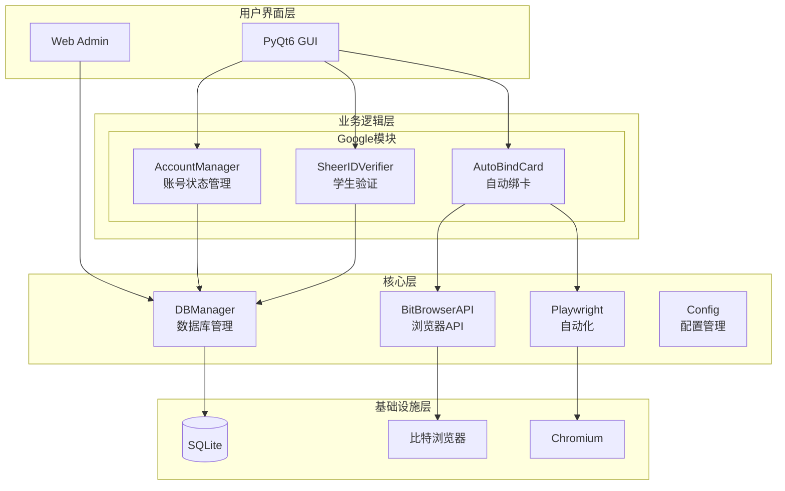
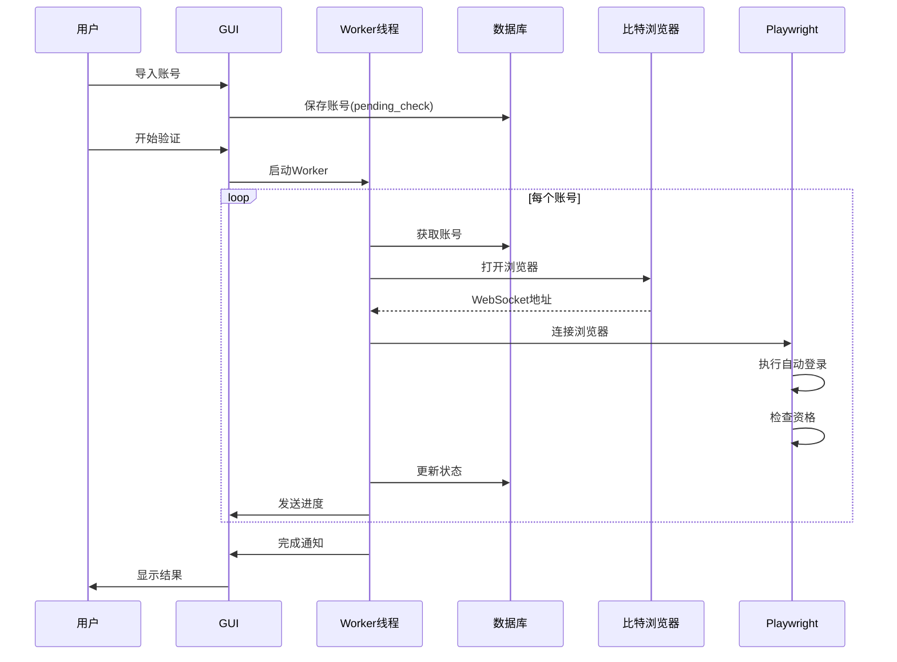

# 项目架构设计文档

## 概述

Auto_All_System_Pyqt 是一个用于自动化管理Google账号的桌面应用程序，支持：
- 账号导入和管理
- 学生资格验证（SheerID）
- 自动登录和绑卡
- Web管理界面

## 技术栈

| 组件 | 技术 |
|------|------|
| GUI框架 | PyQt6 |
| 浏览器自动化 | Playwright |
| 浏览器管理 | 比特浏览器 API |
| 数据库 | SQLite |
| Web服务 | Python http.server |
| 2FA验证 | pyotp |

---

## 目录结构

```
Auto_All_System_Pyqt/
├── src/                          # 源代码目录
│   ├── core/                     # 核心公共模块
│   │   ├── __init__.py
│   │   ├── config.py             # 统一配置管理
│   │   ├── database.py           # 数据库管理器
│   │   ├── bitbrowser_api.py     # 比特浏览器API封装
│   │   ├── bit_api.py            # 比特浏览器简化接口
│   │   └── bit_playwright.py     # Playwright自动化封装
│   │
│   ├── google/                   # 谷歌业务模块
│   │   ├── __init__.py
│   │   ├── backend/              # 后端业务逻辑
│   │   │   ├── __init__.py
│   │   │   ├── account_manager.py    # 账号状态管理
│   │   │   └── sheerid_verifier.py   # SheerID验证器
│   │   │
│   │   └── frontend/             # 前端GUI界面
│   │       └── __init__.py       # GUI模块导出
│   │
│   ├── web/                      # Web管理模块（通用）
│   │   ├── __init__.py
│   │   ├── server.py             # HTTP服务器
│   │   ├── static/               # 静态资源
│   │   │   ├── css/
│   │   │   └── js/
│   │   └── templates/            # HTML模板
│   │
│   ├── workers/                  # 工作线程模块
│   │   ├── __init__.py
│   │   └── base_worker.py        # 基础工作线程类
│   │
│   ├── _legacy/                  # 旧代码存档
│   │   └── README.md
│   │
│   └── main.py                   # 程序入口
│
├── data/                         # 数据目录
│   └── accounts.db               # SQLite数据库
│
├── docs/                         # 文档
│   ├── 数据库设计文档.md
│   └── 架构设计文档.md
│
├── dist/                         # 打包输出
└── resources/                    # 资源文件
```

---

## 模块架构图



---

## 核心模块说明

### 1. core/config.py - 配置管理

统一管理项目路径和配置：

```python
class Config:
    """
    项目配置类
    """
    # 路径配置
    PROJECT_ROOT   # 项目根目录
    SRC_DIR        # 源代码目录
    DATA_DIR       # 数据目录
    DB_PATH        # 数据库路径
    
    # 运行时配置
    DEBUG          # 调试模式
    LOG_LEVEL      # 日志级别
```

### 2. core/database.py - 数据库管理

统一的数据库CRUD操作：

```python
class DBManager:
    @staticmethod
    def init_db()              # 初始化数据库
    @staticmethod
    def upsert_account(...)    # 插入/更新账号
    @staticmethod
    def get_all_accounts()     # 获取所有账号
    # ... 更多方法
```

### 3. core/bitbrowser_api.py - 比特浏览器API

封装比特浏览器本地服务API：

```python
class BitBrowserAPI:
    def create_browser(...)    # 创建浏览器窗口
    def open_browser(...)      # 打开浏览器
    def close_browser(...)     # 关闭浏览器
    def delete_browser(...)    # 删除浏览器
    def list_browsers(...)     # 获取浏览器列表
```

### 4. workers/base_worker.py - 基础工作线程

PyQt6多线程基类：

```python
class BaseWorker(QThread):
    log_signal = pyqtSignal(str)
    progress_signal = pyqtSignal(int, int, str)
    status_signal = pyqtSignal(str, str, str)
    
    def stop()                 # 停止任务
    def pause()                # 暂停任务
    def resume()               # 恢复任务
    def log(message)           # 发送日志
    def update_progress(...)   # 更新进度
```

---

## 数据流设计

### 账号处理流程



---

## 设计原则

### 1. 前后端分离

```
┌─────────────────────────────────────────────────┐
│                    前端层                         │
│  ┌──────────────┐  ┌──────────────┐             │
│  │  PyQt6 GUI   │  │  Web Admin   │             │
│  └──────────────┘  └──────────────┘             │
└─────────────────────────────────────────────────┘
                        │
                        ▼
┌─────────────────────────────────────────────────┐
│                    后端层                         │
│  ┌──────────────┐  ┌──────────────┐             │
│  │ AccountMgr   │  │ SheerIDVerify│             │
│  └──────────────┘  └──────────────┘             │
└─────────────────────────────────────────────────┘
                        │
                        ▼
┌─────────────────────────────────────────────────┐
│                    核心层                         │
│  ┌─────────┐ ┌─────────┐ ┌─────────┐           │
│  │ Database│ │ BitAPI  │ │Playwright│           │
│  └─────────┘ └─────────┘ └─────────┘           │
└─────────────────────────────────────────────────┘
```

### 2. 模块化设计

- **core/**: 与业务无关的通用模块
- **google/**: 谷歌业务专属模块
- **web/**: 通用Web管理模块（不限于特定业务）
- **workers/**: 可复用的工作线程

### 3. 可扩展性

添加新业务（如其他平台）时，只需创建类似结构：

```
src/
├── google/          # 已有
├── facebook/        # 新业务
│   ├── backend/
│   └── frontend/
└── twitter/         # 新业务
    ├── backend/
    └── frontend/
```

---

## API设计

### Web Admin API

| 端点 | 方法 | 说明 |
|------|------|------|
| `/api/accounts` | GET | 获取所有账号 |
| `/api/accounts/stats` | GET | 获取账号统计 |
| `/api/accounts/import` | POST | 批量导入账号 |
| `/api/accounts/delete` | POST | 删除账号 |
| `/api/accounts/export` | POST | 导出账号 |
| `/api/proxies` | GET | 获取所有代理 |
| `/api/proxies/import` | POST | 批量导入代理 |
| `/api/proxies/delete` | POST | 删除代理 |
| `/api/cards` | GET | 获取所有卡片 |
| `/api/cards/import` | POST | 批量导入卡片 |
| `/api/cards/delete` | POST | 删除卡片 |
| `/api/settings` | GET | 获取设置 |
| `/api/settings/save` | POST | 保存设置 |
| `/api/logs` | GET | 获取操作日志 |

---

## 运行方式

### 启动GUI

```bash
python src/main.py
```

### 启动Web Admin

```bash
python src/main.py --web --port 8080
```

### 直接运行Web服务

```bash
python src/web/server.py
```

---

## 依赖说明

### 必需依赖

```
PyQt6>=6.0.0
playwright>=1.40.0
pyotp>=2.8.0
requests>=2.28.0
deep-translator>=1.11.0
```

### 可选依赖

```
bitbrowser_api  # 比特浏览器官方库（可用内置实现替代）
```

---

## 未来规划

1. **完成GUI模块迁移** - 将剩余的GUI文件迁移到 `google/frontend/`
2. **添加单元测试** - 为核心模块添加测试用例
3. **支持多业务** - 添加其他平台的自动化支持
4. **优化性能** - 支持并发处理多个账号
5. **国际化** - 支持多语言界面

---

*文档更新日期: 2026-01-21*
